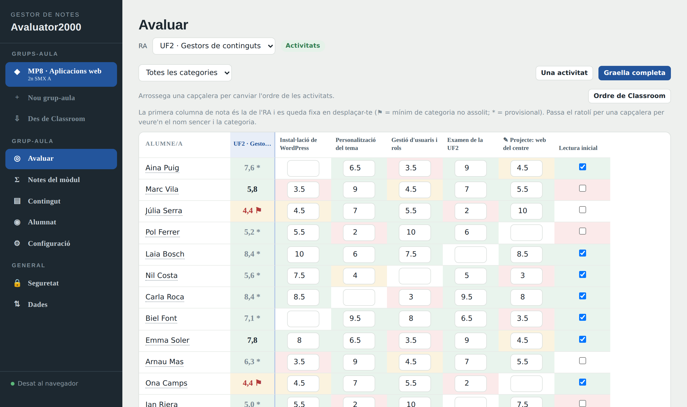
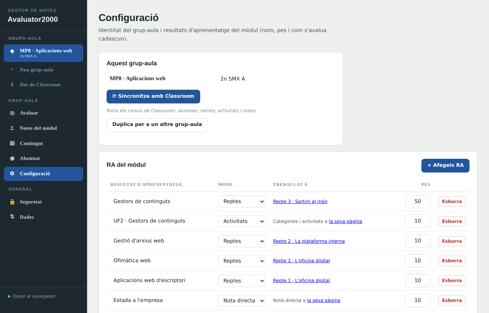
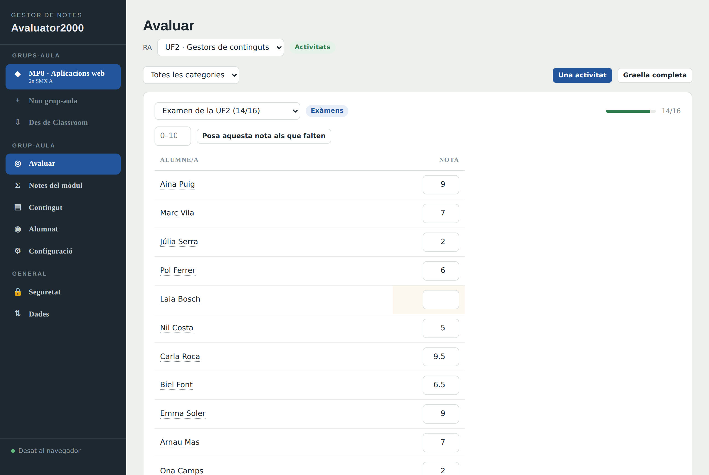
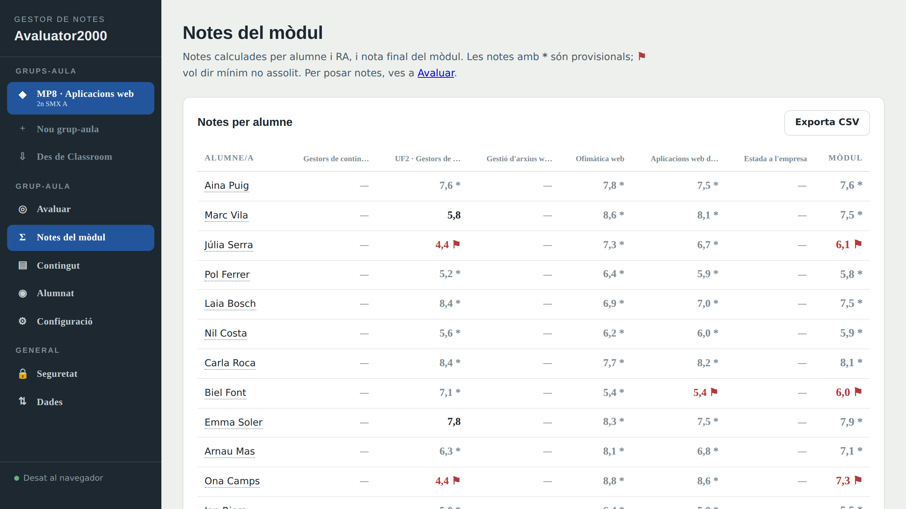
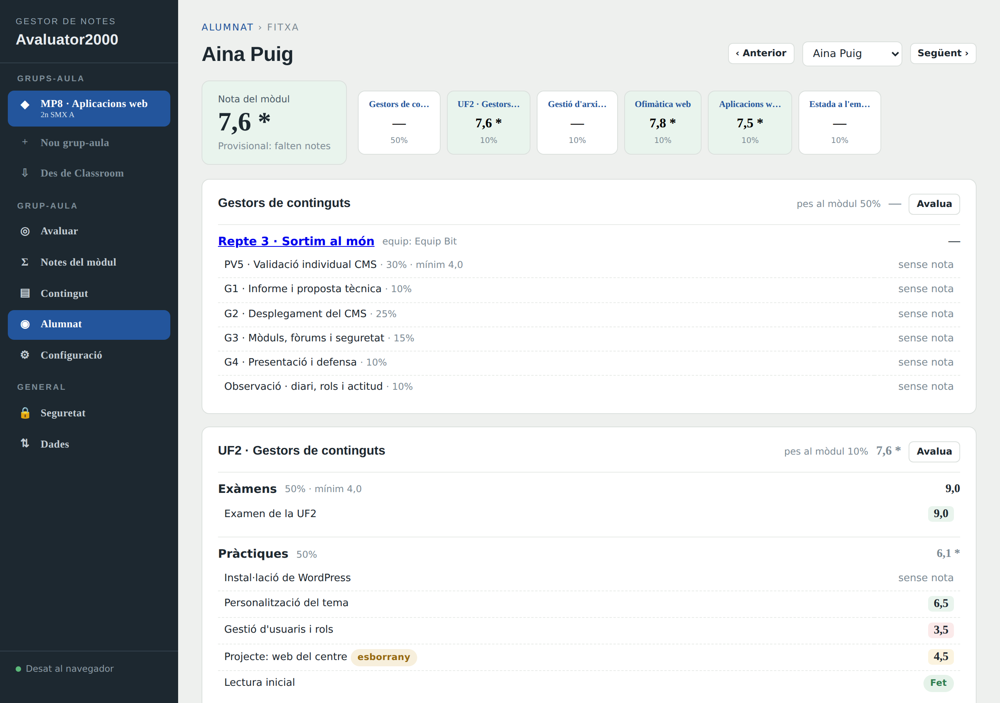
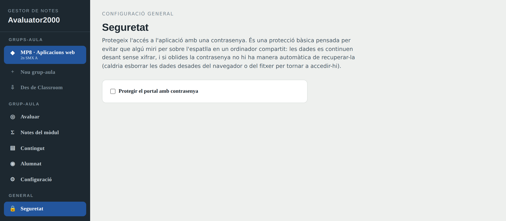

# Avaluator2000

Gestor de notes per a mòduls professionals. Calcula la nota de cada **resultat d'aprenentatge (RA)** i la nota final del mòdul a partir de reptes, activitats o notes directes, i s'integra amb **Google Classroom** per importar-ne alumnat, temes, tasques, rúbriques i notes.

Està pensat per a docents, no per a informàtics: és **un sol fitxer HTML** i s'instal·la en uns minuts al teu propi Google Drive. Les dades són teves i no surten del teu compte de Google.

---

## Què fa

- **Notes per RA i del mòdul**, calculades soles a partir del que hi poses.
- **Tres maneres d'avaluar un RA**, i pots barrejar-les dins del mateix mòdul:
  - **Activitats** amb categories ponderades (Exàmens 50%, Pràctiques 50%…).
  - **Reptes** amb equips, entregables i rúbriques per nivells.
  - **Nota directa**, per a coses com l'estada a l'empresa.
- **Notes mínimes**: pots exigir un mínim (per exemple un 4 als exàmens); si no s'assoleix, l'RA surt marcat com a pendent encara que la mitjana aprovi.
- **Integració amb Google Classroom**: importa alumnat, temes (cada tema es converteix en un RA), tasques amb la seva categoria, rúbriques i les notes que ja hi tinguis posades (també les pendents de publicar). Després pots **sincronitzar** per anar portant els canvis.
- **Multi grup-aula**: el mateix mòdul a dos grups, o mòduls diferents, tot a la mateixa aplicació.
- **Fitxa de l'alumne** amb totes les seves notes organitzades per RA.
- **Bloqueig amb contrasenya** opcional, per si fas servir un ordinador compartit.

---

## Instal·lació (uns 10 minuts)

Només necessites un compte de Google. No cal instal·lar res a l'ordinador ni saber programar.

### 1. Descarrega els fitxers

Al botó verd **Code** d'aquest repositori → **Download ZIP**, i descomprimeix-lo. Necessitaràs tres fitxers:

| Fitxer | Per a què serveix |
|---|---|
| `avaluator2000.html` | L'aplicació |
| `Code.gs` | El codi que la publica i desa les dades al teu Drive |
| `appsscript.json` | La llista de permisos que cal demanar a Google |

### 2. Crea el projecte

1. Ves a **[script.new](https://script.new)** (es crea un projecte d'Apps Script buit).
2. A dalt, posa-li un nom: `Avaluator2000`.

### 3. Enganxa el codi

1. Al fitxer **`Code.gs`** que et surt a la pantalla, esborra tot el que hi ha i enganxa-hi el contingut del `Code.gs` que has descarregat.
2. Al menú de l'esquerra, al costat de **Fitxers**, prem **+** → **HTML**.
3. Anomena'l exactament **`index`** (en minúscules, sense `.html`).
4. Esborra el contingut que porta i enganxa-hi **tot** el contingut d'`avaluator2000.html`.
5. Prem **Desa** (la icona del disquet).

> **Important**: el fitxer HTML s'ha de dir `index`. Si li poses un altre nom, l'aplicació no s'obrirà.

### 4. Activa Google Classroom (opcional però recomanat)

Si vols importar dades de Classroom:

1. Al menú de l'esquerra, a **Serveis**, prem **+**.
2. Busca **Google Classroom API**, selecciona-la i prem **Afegeix**.

### 5. Posa els permisos

1. A l'esquerra, prem l'engranatge de **Configuració del projecte**.
2. Marca la casella **«Mostra el fitxer de manifest appsscript.json a l'editor»**.
3. Torna a l'editor: ara hi ha un fitxer `appsscript.json`. Obre'l, esborra el contingut i enganxa-hi el de l'`appsscript.json` descarregat.
4. **Desa**.

> Aquest pas evita l'error *«The caller does not have permission»* en importar de Classroom. Google no dedueix sol tots els permisos que calen.

### 6. Publica l'aplicació

1. A dalt a la dreta: **Implementa** → **Nova implementació**.
2. A l'engranatge del costat de «Selecciona el tipus», tria **Aplicació web**.
3. Configura-ho així:
   - **Executa com a**: *Jo*
   - **Qui té accés**: *Només jo*
4. Prem **Implementa** i **Autoritza l'accés**.
5. Google t'avisarà que l'aplicació no està verificada: és normal, perquè l'has feta tu. Prem **Configuració avançada** → **Ves a Avaluator2000 (no segur)** → **Permet**.
6. Copia l'**URL de l'aplicació web** (acaba en `/exec`) i desa-la als marcadors. **Aquesta és la teva aplicació.**

### 7. On es desen les dades

El primer cop que l'obris es crearà tot sol un fitxer **`avaluator2000.json`** al teu Google Drive. Aquí hi ha tot: grups-aula, alumnat, activitats i notes. El pots moure a la carpeta que vulguis, que el seguirà trobant pel nom.

> **Fes còpies de seguretat de tant en tant**: a **Dades → Exporta**. Et baixa un fitxer que pots tornar a importar si mai cal.

### Si més endavant actualitzes l'aplicació

Quan enganxis una versió nova del codi **no n'hi ha prou amb desar**: has de tornar a publicar. **Implementa** → **Gestiona les implementacions** → llapis (✏️) → **Versió: Nova** → **Implementa**.

---

## Guia d'ús

### Per on començar

Un **grup-aula** és un mòdul impartit a un grup concret (per exemple *MP8 · Aplicacions web* a *2n SMX A*). A la barra lateral els tens tots, i pots crear-ne de nous o importar-los directament de Classroom.

La barra lateral no canvia mai i té sempre les mateixes cinc seccions:

| Secció | Per a què |
|---|---|
| **Avaluar** | Posar notes. És l'únic lloc on se'n posen. |
| **Notes del mòdul** | Veure les notes calculades de tothom. |
| **Contingut** | Definir l'estructura: reptes, activitats, categories. |
| **Alumnat** | La llista d'alumnes del grup. |
| **Configuració** | Els RA del mòdul, el nom del grup i la sincronització. |

### Opció A: començar des de Google Classroom (el més ràpid)

A la barra lateral, **⇩ Des de Classroom** i tria el curs. L'aplicació crearà el grup-aula sencer:

- L'**alumnat** del curs.
- **Un RA per cada tema** de Classroom, amb el nom del tema.
- Les **activitats** de cada tema, amb la seva categoria i el seu pes.
- Les **rúbriques**, si en tenen.
- Les **notes** que ja hi tinguessis posades, incloses les pendents de publicar.

Després només cal revisar dues coses a **Configuració**: el **pes de cada RA** (es reparteix a parts iguals, i segurament no és el que vols) i el **pes de les categories** dins de cada RA (Classroom els reparteix entre totes les categories del curs, així que en separar-les per temes poden no sumar 100%).

### Opció B: començar de zero

**+ Nou grup-aula**, i després a **Configuració** afegeix els RA amb el seu nom i pes, i tria com s'avalua cadascun:

- **Activitats** → a **Contingut** crees les categories i les activitats.
- **Reptes** → a **Contingut** crees el repte, amb equips, entregables i rúbriques.
- **Nota directa** → la nota la poses directament a **Avaluar**.

Els pesos dels RA han de sumar 100%: l'aplicació t'avisa en vermell si no quadren.

### Posar notes

A **Avaluar** tries l'RA a dalt i tens dues maneres de treballar:

**Graella completa** — totes les activitats alhora, com un quadern de notes. El nom de l'alumne i la nota de l'RA queden fixos quan et desplaces cap a la dreta. Els colors t'avisen d'un cop d'ull: vermell per sota de 4, groc entre 4 i 5, verd de 5 en amunt. Pots **arrossegar les capçaleres** per canviar l'ordre de les activitats.

**Una activitat** — més còmode per corregir seguit: tries una activitat i poses la nota de tothom, i amb **Enter** saltes a l'alumne següent. També pots omplir de cop els que falten.

Si l'activitat té **rúbrica** importada de Classroom, en lloc de la nota veuràs un desplegable per cada criteri i la nota es calcularà sola.

### Consultar les notes

**Notes del mòdul** mostra tothom amb la nota de cada RA i la final:

- Una nota amb **\*** és **provisional**: encara falten activitats per avaluar.
- Una nota amb **⚑** vol dir que hi ha un **mínim no assolit**: tot i que la mitjana aprovi, l'RA està pendent.

Clicant el nom de qualsevol alumne (aquí, o a la graella) arribes a la seva **fitxa**, amb tot el detall organitzat per RA:

### Mantenir-ho sincronitzat amb Classroom

A **Configuració** → **⟳ Sincronitza amb Classroom**. Et mostra què canviarà **abans** de fer res:

- Alumnes nous, noms canviats, i qui ja no és al curs.
- Temes nous (es creen com a RA) i temes reanomenats.
- Activitats noves, modificades, o que han canviat de tema.
- Notes noves.

Pots triar si les notes només **omplen els buits** (per defecte, no toca res del que hagis posat tu) o si **sobreescriuen** amb les de Classroom.

> **No s'esborra mai res.** El que desapareix de Classroom només queda marcat amb una etiqueta *«fora de Classroom»*, per no perdre notes sense voler. Ja decideixes tu què en fas.

### Altres coses útils

- **Duplicar un grup-aula** (a Configuració): copia tota l'estructura —RA, reptes, categories, activitats— però sense alumnat ni notes. És la manera de donar el mateix mòdul a un altre grup, o de reutilitzar-lo el curs vinent.
- **Exportar a CSV** des de *Notes del mòdul*, per passar les notes a un full de càlcul.
- **Bloqueig amb contrasenya** (a Seguretat): protegeix l'aplicació si fas servir un ordinador compartit, amb bloqueig automàtic per inactivitat.

> El bloqueig és una pantalla de bloqueig, **no xifratge**. Evita que algú miri per sobre l'espatlla, però les dades es continuen desant sense xifrar al teu Drive. I si oblides la contrasenya no hi ha manera de recuperar-la.

---

## Preguntes freqüents

**Puc fer-lo servir sense Google Drive?**
Sí. Obrint el fitxer `avaluator2000.html` directament al navegador funciona tot menys Classroom. Les dades es desen al navegador i, amb Chrome o Edge, pots connectar un fitxer local perquè s'hi desin soles.

**Els meus alumnes poden veure les seves notes?**
No. L'aplicació és només per al docent: no hi ha accés per a l'alumnat.

**Puc compartir-la amb altres docents del centre?**
Cadascú s'ha de fer la seva instal·lació, amb les seves pròpies dades. Si publiques l'aplicació amb accés *«Qualsevol usuari del domini»* tots compartireu **el mateix** fitxer de dades, cosa que normalment no és el que vols.

**M'he equivocat i vull tornar a començar.**
A **Dades → Restableix** s'esborra tot i es carrega un exemple. Exporta abans, per si de cas.

**Em surt «The caller does not have permission» en importar de Classroom.**
Falta algun permís: repassa el pas 5 de la instal·lació i, després, torna a publicar (*Implementa → Gestiona les implementacions → Versió: Nova*). Comprova també que ets **professor/a** del curs que vols importar.

**He canviat el codi però l'aplicació segueix igual.**
Desar no publica. Has de fer *Implementa → Gestiona les implementacions → ✏️ → Versió: Nova → Implementa*.

---

## Llicència

Aquest projecte es distribueix sota la **[EUPL v1.2](LICENSE)** (European Union Public Licence), la llicència lliure oficial de la Comissió Europea.

Això vol dir que **el pots fer servir, estudiar, modificar i compartir lliurement**. Si en distribueixes una versió modificada, cal que ho facis sota la mateixa llicència (o una de compatible) i que en donis també el codi font: així les millores reverteixen a la comunitat docent.

Tres detalls útils si l'has de fer servir en un centre educatiu públic:

- És **dret europeu**: una Decisió de la Comissió Europea, vàlida a tots els estats membres i disponible en 23 llengües oficials de la UE.
- Està **aprovada per l'OSI** com a llicència de codi obert i és compatible amb la GPL i altres llicències habituals (vegeu l'apèndix del text).
- A diferència de moltes llicències nord-americanes, **es regeix per la legislació del país de la UE** on resideix qui la publica.

Copyright © 2026 Bahe · vegeu [NOTICE.txt](NOTICE.txt)
